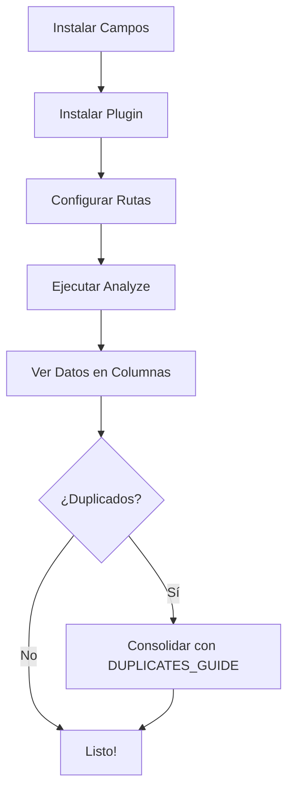

# All Libraries Stats Plugin - START HERE

¡Bienvenido! Este plugin te ayuda a **analizar autores, libros y detectar duplicados** en múltiples librerías de Calibre.

## ¿Qué hace el plugin?

El plugin **All Libraries Stats** analiza automáticamente todas tus librerías de Calibre y actualiza campos personalizados con:

1. **En qué librerías aparece cada autor** (ej: "Principal, Clásicos, Ficción")
2. **Cuántos libros totales tiene cada autor** sumando todas las librerías (ej: 8 libros)
3. **Dónde aparece cada combinación título+autor** para detectar duplicados (ej: "Principal, Backup")

### Ejemplo

Tienes 3 librerías con estos libros:

```
Librería "Principal":
  ✓ "El Quijote" de Cervantes
  ✓ "Don Juan" de Molina

Librería "Clásicos":
  ✓ "El Quijote" de Cervantes
  ✓ "Ilíada" de Homero

Librería "Ficción":
  ✓ "1984" de Orwell
```

Después de ejecutar el análisis:

- **Cervantes**: Aparece en 2 librerías (Principal, Clásicos) con 2 libros
- **"El Quijote" de Cervantes**: Es un DUPLICADO (está en Principal y Clásicos)
- **"Don Juan" de Molina**: Es único (solo en Principal)
- **Orwell**: Aparece en 1 librería (Ficción) con 1 libro

## ¿Por Dónde Empiezo?

### Si Tienes 2 Minutos: Instalación Rápida
→ Lee **[QUICK_START.md](QUICK_START.md)**

Aquí encontrarás:
- Cómo crear los 3 campos necesarios
- Cómo instalar el plugin
- Cómo ejecutar el análisis
- Verificación rápida de que funciona

### Si Tienes 5 Minutos: Guía Completa
→ Lee **[INSTALLATION.md](INSTALLATION.md)**

Aquí encontrarás:
- Guía paso-a-paso detallada
- Creación de campos personalizados en Calibre
- Configuración completa
- Verificación avanzada
- Troubleshooting

### Si Quieres Entender Duplicados (v1.2.0+)
→ Lee **[DUPLICATES_GUIDE.md](DUPLICATES_GUIDE.md)**

Aquí encontrarás:
- Cómo funciona la detección de duplicados
- Ejemplos con múltiples autores
- Cómo consolidar duplicados
- Casos especiales

### Si Eres Técnico
→ Lee **[TECHNICAL_DOCS.md](TECHNICAL_DOCS.md)**

Aquí encontrarás:
- Arquitectura del plugin
- Estructura de datos
- Queries SQL utilizadas
- Métodos principales
- Detalles de implementación v1.2.0

### Si Tienes Problemas o Errores
→ Lee **[DEBUGGING_GUIDE.md](DEBUGGING_GUIDE.md)**

Aquí encontrarás:
- **Cómo ejecutar Calibre en modo debug**: `calibre-debug -g`
- Solución de errores comunes
- Scripts de testing para investigar problemas
- Trazabilidad completa de logs
- Análisis manual de librerías

### Si Solo Quieres Referencia
→ Lee **[README.md](README.md)**

Aquí encontrarás:
- Descripción general
- Características principales
- Tabla de campos
- Ejemplos

---

## Requisitos Previos

- **Calibre 2.0+** instalado
- Acceso a **Preferences** en Calibre
- **Múltiples librerías** configuradas (el plugin ahora en v1.2.0 funciona incluso con una)
- Los **3 campos personalizados** creados en Calibre

## Pasos de Instalación (Resumen)

1. **Crear 3 campos** en Calibre:
   - `#author_libraries` (Texto)
   - `#author_total_books` (Números)
   - `#duplicate_titles` (Texto) - NUEVO en v1.2.0

2. **Instalar el plugin** vía Calibre Preferences

3. **Configurar rutas** en Preferencias del Plugin

4. **Ejecutar**: Tools → All Libraries Stats → Analyze Authors in All Libraries

5. **Verificar**: Busca datos en los 3 campos

**¿Necesitas ayuda?** → [QUICK_START.md](QUICK_START.md) o [INSTALLATION.md](INSTALLATION.md)

---

## Principales Cambios en v1.2.0

### 🎯 Detección de Duplicados Mejorada

La versión 1.2.0 introduce un **nuevo campo y mejor detección de duplicados**:

**Antes (v1.1.0):**
- Buscaba duplicados por título solo
- Problema: "El Quijote" de Cervantes se confundía con "El Quijote" de García

**Ahora (v1.2.0):**
- Busca por **título + autor** (combinación)
- Si hay múltiples autores, **basta que UNO coincida**
- Resultado: Detección más precisa

### Campo Nuevo

**`#duplicate_titles`** (Nuevo en v1.2.0)
- Muestra en qué librerías aparece el **mismo título con el mismo autor**
- Ejemplo: "Principal, Clásicos" significa el libro está en ambas librerías
- Diferencia claramente entre diferentes autores

### Ejemplo del Mejora

```
Escenario:

Librería A: "El Quijote" de Cervantes
Librería B: "El Quijote" de García
Librería C: "El Quijote" de Cervantes

Resultado v1.2.0:

- "El Quijote" Cervantes → duplicate_titles = "A, C" ✓
- "El Quijote" García → duplicate_titles = "B" ✓

(NO confunde diferentes autores)
```

---

## Manual de Referencia Rápida

| Necesito | Ir a |
|----------|------|
| Instalar en 2 min | [QUICK_START.md](QUICK_START.md) |
| Guía paso-a-paso | [INSTALLATION.md](INSTALLATION.md) |
| Entender duplicados | [DUPLICATES_GUIDE.md](DUPLICATES_GUIDE.md) |
| Ver técnica | [TECHNICAL_DOCS.md](TECHNICAL_DOCS.md) |
| Descripción completa | [README.md](README.md) |
| Ver cambios | [CHANGELOG.md](CHANGELOG.md) |

---

## Preguntas Comunes

### ¿Necesito múltiples librerías para usar el plugin?

Sí, originalmente el plugin fue diseñado para analizar múltiples librerías. Sin embargo, en v1.2.0 también funciona con una sola librería mostrando información de autores.

### ¿Qué pasa si NO creo los campos?

El plugin mostrará error al ejecutarse. Debes crear los 3 campos personalizados en Calibre primero.

### ¿Puedo usar otros nombres para los campos?

Sí, pero debes configurarlos en las Preferencias del plugin con los nombres que uses.

### ¿Qué significa "duplicate_titles"?

Significa que el mismo título + autor aparece en múltiples librerías. Ej: Tienes "El Quijote" de Cervantes en tu librería "Principal" Y en "Clásicos".

### ¿Y si un libro no tiene autor?

El plugin lo etiqueta como "Unknown" (Desconocido) y lo trata como un autor normal para búsquedas.

### ¿Se modifica la librería?

No. El plugin:
- ✓ SOLO ESCRIBE en los 3 campos personalizados de la librería actual
- ✗ NO modifica otros datos
- ✗ NO crea nuevos libros
- ✗ NO elimina contenido

### ¿Qué tan rápido es?

Depende de cuántas librerías y libros tengas:
- 2 librerías: ~2-3 segundos
- 5 librerías: ~5-10 segundos
- 10+ librerías: ~10-30 segundos

---

## Flujo de Uso Típico



---

## Documentos en Este Paquete

```
All Libraries Stats Plugin/
├── START_HERE.md              ← Tú estás aquí
├── QUICK_START.md             ← Instalación rápida
├── INSTALLATION.md            ← Guía completa
├── README.md                  ← Descripción general
├── DUPLICATES_GUIDE.md        ← Casos de duplicados
├── TECHNICAL_DOCS.md          ← Arquitectura técnica
├── CHANGELOG.md               ← Historial de cambios
├── LICENSE                    ← Licencia del plugin
├── __init__.py                ← Código principal
├── action.py                  ← Lógica de análisis
├── config.py                  ← Configuración UI
└── plugin-import-name-*.txt   ← Metadatos del plugin
```

---

## Próximos Pasos

**Opción 1 (Recomendado):**
1. Lee [QUICK_START.md](QUICK_START.md) (5 minutos)
2. Instala y ejecuta
3. Consulta [DUPLICATES_GUIDE.md](DUPLICATES_GUIDE.md) si tienes preguntas

**Opción 2 (Detallado):**
1. Lee [INSTALLATION.md](INSTALLATION.md) (15 minutos)
2. Sigue paso-a-paso
3. Verifica con ejemplos incluidos

**Opción 3 (Técnico):**
1. Lee [TECHNICAL_DOCS.md](TECHNICAL_DOCS.md)
2. Revisa el código en `action.py`
3. Entiende la arquitectura

----

## ¿Problemas?

1. **Error al instalar**: Ver [QUICK_START.md](QUICK_START.md) sección Troubleshooting
2. **Campos no aparecen**: Verificar [INSTALLATION.md](INSTALLATION.md) paso 2
3. **Duplicados no detectados**: Ver [DUPLICATES_GUIDE.md](DUPLICATES_GUIDE.md) casos especiales
4. **Problemas técnicos**: Ver [TECHNICAL_DOCS.md](TECHNICAL_DOCS.md) sección Errores

---

**¿Listo para empezar?** → **[QUICK_START.md](QUICK_START.md)** 🚀

**Versión**: 1.2.0  
**Última actualización**: Marzo 2024
